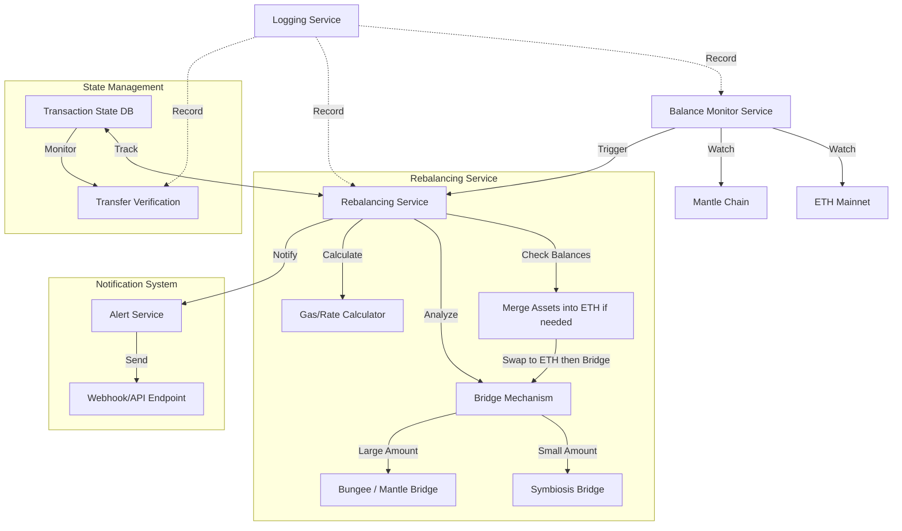

### Rebalancer Service Architecture

A high-level implementation of rebalancer service which can rebalance assets between the ETH
Mainnet and the Mantle Chain.



In this flow:

- We first check if assets on Mantle must be swapped to ETH (or vice versa) before bridging.
- The Rebalancing Service merges assets into ETH on whichever chain they're originally held, then performs bridging to the target chain.
- Using the Max-Flow Min-Cut analogy, we can calculate the best path for rebalancing based on gas fees and rates.

### Getting Started

Clone the repository and install dependencies. Add your .env file with the required keys.

```bash
git clone https://github.com/your-repo/rebalance-bot.git
cd rebalance-bot
cp .env.example .env
npm install
npm run dev
```

Or use Docker to run the service:

```bash
docker build -t rebalance-bot .
docker run -d --name rebalance-bot -p 3000:3000 rebalance-bot
```

### Future Enhancements for Production

1. Use NestJS: better structuring of controllers, services.
2. Fallback solutions: Implement (Symbiosis Bridge, Mantle Bridge, etc.) without relying solely on Bungee.
3. WebSockets: For tg bot instead of long-polling, which can fail in multi-server setups.
