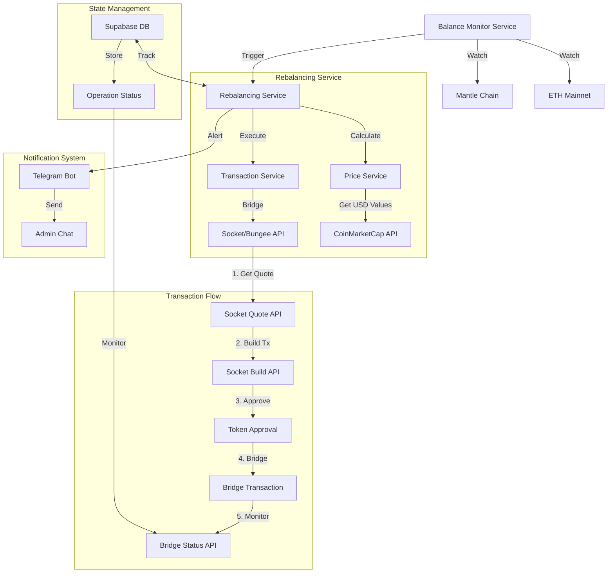

## Rebalancer Service Architecture

A high-level implementation of a rebalancer service that automatically rebalances assets between ETH Mainnet and Mantle Chain using Socket/Bungee for bridging.



In this flow:

- Price based rebalancing: Using CMC API to calculate USD values for accurate rebalancing.
- Multi Step Bridging: Supports direct token bridging any token→ETH→token paths.
- Transaction Monitoring: Tracks bridge status and handles transaction failures
- State Management: Uses Supabase to track operation status and resume interrupted operations
- Admin Notifications: Telegram bot integration for monitoring and alerts

### Getting Started

Clone the repository and install dependencies. Add your .env file with the required keys.

```bash
git clone https://github.com/your-repo/rebalance-bot.git
cd rebalance-bot
cp .env.example .env
npm install
npm run dev
```

Or use Docker:
```bash
docker build -t rebalancer .
docker run -d --name rebalancer --env-file .env rebalancer
```

### Future Enhancements for Production

1. Smart Contract: Add support for smart contracts(safe) for rebalancing.
2. Fallback solutions: Implement (Symbiosis Bridge, Mantle Bridge, etc.) without relying solely on Bungee.
3. WebSockets: For tg bot instead of long-polling, which can fail in multi-server setups.
4. Use NestJS: better structuring of controllers, services.
